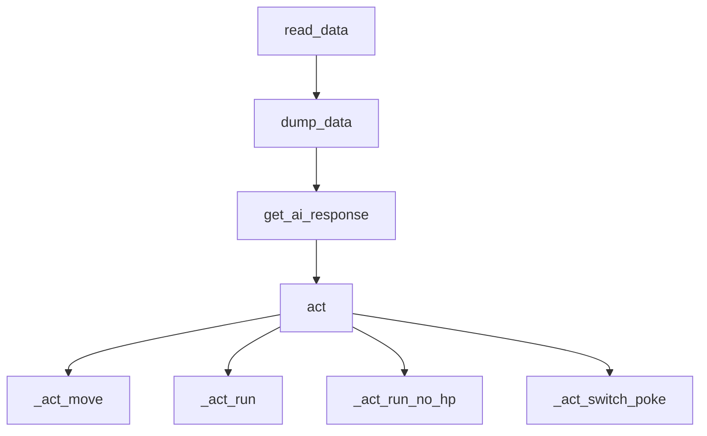

# Running Process

## File Structure

```cpp
/
├── app.py  // Web server edition
├── cli.py  // Command line tool
├── data_analyze  // Data analysis and processing
│   └── data_analyze.py
├── engine
│   ├── api.py  // Request api of ai
│   ├── component.py  // Some useful function
│   ├── fight.py  // Fighting modles
│   ├── index_data.py  // The data of number
│   ├── __init__.py
│   ├── map.py  // UNFINISH! Map and moving
│   └── prompt  // The prompt which give to ai
│       ├── fight.txt
│       └── system_prompt.txt
├── main.py  // The local running edition
├── readme.md
├── red.gb  // Game File
├── red.gb.state // Game state file
├── requirements.txt
├── secret_setting.json.example
├── static // Fronted static file
│   └── bulma.min.css
├── templates
│   └── index.html // Fronted
├── test
│   ├── data  // Some settings
│   │   ├── 001_simple.yaml
│   │   ├── 002_ViridianForest.yaml
│   │   └── 003_Cave.yaml
│   ├── __init__.py
│   └── test_fight.py  // Fight test automatic
└── test_record  // Test Record
```

## cli.py

This is the command line management tool, we can customize the run parameters through this, the following are some optional configuration.

### Web Server Mode
```
Usage: cli.py server [OPTIONS]

  Run Server

Options:
  --port INTEGER        Http Server Port
  --addr TEXT           Listen address
  --ws-port INTEGER     WebSocket Port
  --remove-escape       Ablation Escape
  --remove-switch       Ablation Switch Pokemon
  --shell               Shell
  --no-auto             Not have automatic play
  --fight-test          Test fight
  --test-count INTEGER  Test count
  --test-setting TEXT   Test setting
  --skip-animation      Is skip animation
  --debug               Debug mod
  --help                Show this message and exit.
```

### Local Running Mode

```
Usage: cli.py local [OPTIONS]

  Use pyboy window

Options:
  --remove-escape  Ablation Escape
  --remove-switch  Ablation Switch Pokemon
  --help           Show this message and exit.
```

> [!TIP]
> It is highly recommended to use the Web server version, because it has more features and a better interface, which is used for presentation and also to play the game.


## Entrance logic

### app.py Web Server

#### Threads

A total of four threads are opened in this program (If use --shell).

1. Pyboy Thread
   - The main progression of the game (tick)
   - Perform key operations on the client
   - Always detect if it is in battle, and if it is in battle, the operation is given to fight.py
2. Websocket Thread
   - Real-time monitoring of screen differences, if the screen changes, then push the latest picture to the client
   - Of course, the same goes for sending the text status of the game
   - Handle keys on the client
   - Save and load the game according to client requirements
3. Shell Thread
   - A shell is something that lets you execute python code while the game is running
   - It can be used when we want to read or modify the game memory or manipulate certain keys
   - Very useful in testing
4. HTTP Web Thread
   - Used to provide a nice looking front page to the user

#### Pyboy Change

In order to make it easier to operate the game, we inherited the pyboy class and inserted some code

The most important of these is the rewriting of the tick method

https://github.com/siw028/AI-Pokemon-Trainer/blob/3ce64b16f8cb488a4101ec0393bde7fec2f797c1/app.py#L74-L84

In order to provide the latest game screen to the web frontend, we pass the screen data into the last frame in the tick, and the Websocket process handles the communication

> [!TIP]
> Each tick will wait for 0.01s to match the speed of the original game.
> 
> Of course you can use `--skip-animation` to skip this wait
> 
> One user mentioned it in https://github.com/siw028/AI-Pokemon-Trainer/issues/1


### main.py Local Pyboy Window

If you run main.py you can get a native pyboy game window, but since there is no room for customization, it is only used for testing at first, but it is not used much later.

> [!IMPORTANT]
> This feature may be removed later


## Core logic

> Only the battle function is ready for now

### fight.py

When it detects that the fight flag `0xD057` is not $0$, start fight in fight.py is called, a Fight class is instantiated, and execution begins

In `__init__`, it will inital some variable.

And, in `start` function, It consists of jumping pictures and fixed flow.



#### dump_data

In this function, we replace some indexes with human-readable names, and we also put the history of each time into the prompt, which is generated by jinja2

#### Ohter things

In addition, there are some retry mechanisms. You can refer to the code for details.


## Test logic

If the command line argument `--fight-test` is carried, it is the test mode.

***Before starting this feature, you need to put the player on the grass and save it for testing**

> [!NOTE]
> The principle is that the player walks around the grass and comes across a wild Pokemon

The configuration file under `data/` can optionally be loaded, which can modify some memory information before each new battle. Can be used for fixed rank and other functions

For example,

https://github.com/siw028/AI-Pokemon-Trainer/blob/3ce64b16f8cb488a4101ec0393bde7fec2f797c1/test/data/002_ViridianForest.yaml#L1-L3

> [!NOTE]
> The reason for using the yaml format is because you can write comments

### Test Record Structure

```json
[
  {
    "id": 0,
    "total_usage_token": 111,
    "rounds": [
        This is every dump_data's result. However, in order to obtain the result at the end of the dump data will also save the result.
    ]
  }
]
```

More [detile](test_mode.md) for test.
