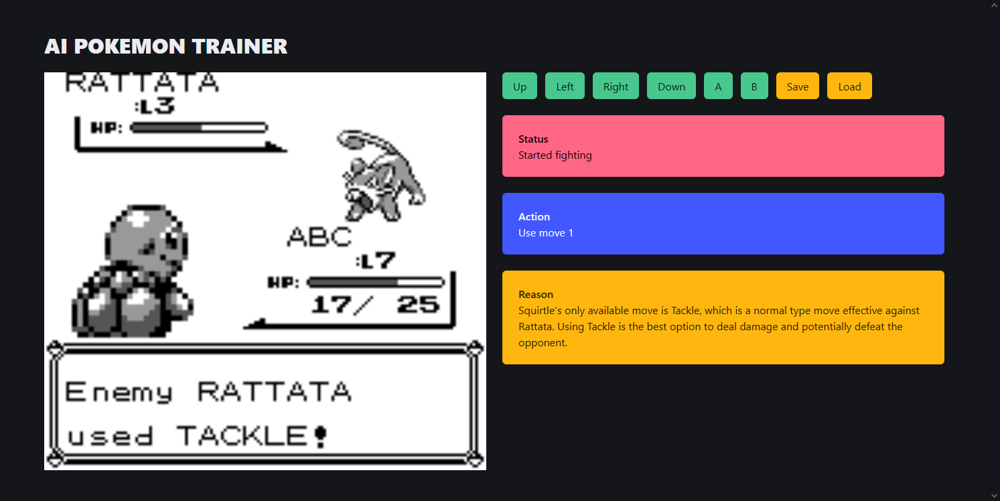

# AI Pokemon Trainer

https://github.com/user-attachments/assets/146c3a4f-a551-475f-a288-3c1493c824e2

## Installtion

Firstly, you need install some package, use pip tool to install.

```bash
pip install -r requirements.txt
```

Then you need copy secret_setting.json.example to secret_setting.json, and typing the AI's api information.

## Usage

There are cli tools in the root folder, `cli.py`.

Run `python3 cli.py server`, you will get a web server which started in 8000 port and 18080 port used by websockets, it have beautiful screen. It's goal is for the normal user to watch how AI work.

Run `python3 cli.py local`, you will get a window that run by pyboy, you can see some detial in the console. It's goal is for test the AI.



## Technical Details

If you want to know more technical details, you can check the more [detailed technical documentation](https://github.com/siw028/AI-Pokemon-Trainer/blob/main/docs/running_process.md)

We collated the [location of some game memory](https://github.com/siw028/AI-Pokemon-Trainer/blob/main/docs/memory_address.md) based on the information on the Internet

## Reference

[Pokémon Red and Blue/Internal Index Number](https://tcrf.net/Pok%C3%A9mon_Red_and_Blue/Internal_Index_Number)

[Pokémon Red and Blue/RAM map](https://datacrystal.tcrf.net/wiki/Pok%C3%A9mon_Red_and_Blue/RAM_map)
